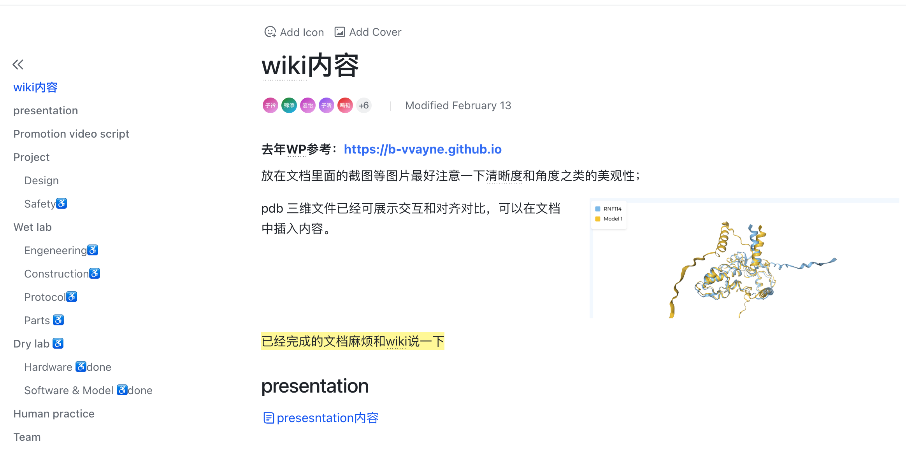

# 文档分离与转换规范

!!! abstract "为了便于维护和翻译，翻译成英文版本后，请额外创建一个独立英文文件（翻译版），并将需要插入的文件也放进去。另外，建议沿用 WP2 的文档规范，维护一个指向所有中英文文档的索引文件，以便于查找和维护。"


!!! warning "可以添加作为附件下载的文件，但请不要在文档中指向不在索引文件中的文档。例如 WP2 中的 [REASONS](https://anyareese.github.io/iGEM2025-WP2/wiki/wetlab/reason-attachment.html) 文档，尽管我最后仍然为此新建了不存在于导航栏的一个页面，但个人认为这其实并不符合规范。"

## 文档对应规则

额外创建一个独立英文文件（翻译版），并将需要插入的文件也放进去

=== "基本示例"
    ```
    # 中文文档
    experiment-protocol-zh
    
    # 英文文档
    experiment-protocol-en
    ```

## 文档同步检查清单

- [ ] 确保两个文档的结构完全对应
- [ ] 专业术语翻译准确统一
- [ ] 如果使用 AI 协助翻译，检查是否改变了原文以及格式!!!
- [ ] 如果使用 AI 协助翻译，检查是否修改/编造了 reference 链接!!!

## 文件组织规范

### 文件命名

!!! note "文件命名规则"
    - 使用小写字母。大写字母出现的问题：本地正常渲染，远端无法识别。
    - 用连字符(-)而非空格分隔单词。使用空格可能导致的问题：识别困难、链接不可用、链接出现%20不美观。
    - 使用有意义的描述性名称。
    
=== "文件命名示例"
    !!! failure "错误命名"
        ```
        add plasmid.dna
        PCR Protocol.md
        abc.dna
        ```

    !!! success "正确命名"
        ```
        pcr-protocol.md
        enzyme-digestion.md
        add-plasmid.dna
        ```

## 常见问题处理

???+ question "如何处理复杂表格？"
    复杂表格的处理建议：

    1. 先完成一种语言的表格
    2. 复制表格结构到另一个文档
    3. 仅替换文字内容，保持格式不变
    4. 使用在线表格生成器确保格式统一

???+ question "如何保持文档结构同步？"
    1. 先完成一种语言的文档框架
    2. 复制整体结构到另一语言文档
    3. 逐段翻译，保持段落对应
    4. 定期对照检查结构一致性

